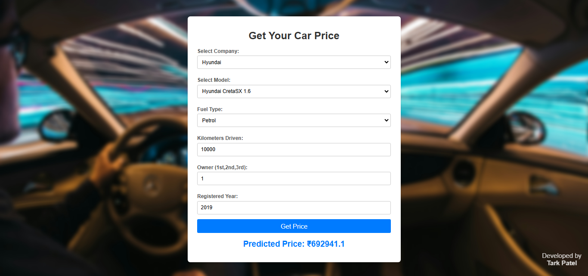

</head>
<body>
    <h1>Car Price Prediction</h1>

  <h2>1. Project Description</h2>
    
This project predicts the price of used cars based on various features such as the car company, model, fuel type, kilometers driven, ownership, and year of registration. The model was trained on a dataset of used car prices and provides accurate predictions to help users estimate the value of a car.

   <h2>2. How to Use</h2>
   
   
<strong>Site Link</strong> ---> <a href="https://car-price-prediction-9tmb.onrender.com/" target="_blank">https://car-price-prediction-9tmb.onrender.com/</a>

    <ol>
        <li>Visit the website.</li>
        <li>Select the car company from the dropdown list.</li>
        <li>Select the car model based on the chosen company.</li>
        <li>Enter the fuel type, kilometers driven, ownership (e.g., 1st, 2nd), and the year of registration.</li>
        <li>Click the <strong>Get Price</strong> button.</li>
        <li>You will see the predicted price of the car displayed on the screen.</li>
    </ol>

  <h2>3. Dataset</h2>
    
The dataset was scraped from a website that lists used cars for sale in India. I collected data about cars from various companies, their models, and their selling prices across different locations in India using the <strong>Beautiful Soup</strong> library.

   <h2>4. Model Training Approach</h2>
    
I cleaned and preprocessed the dataset to remove irrelevant or noisy data. Several machine learning algorithms were used to train the model, including:

    <ul>
        <li>XGBoost Regressor</li>
        <li>Gradient Boosting</li>
        <li>Random Forest</li>
    </ul>
    
After evaluation, Gradient Boosting provided the best results with an R2 score of <strong>87%</strong>. Hyperparameter tuning was applied to optimize the performance of the model.

   <h2>5. Deploying Through Render</h2>
    
I Deploy my model through Render.com.

   
Steps:

    <ul>
        <li>Render Setup: Create a Render.com account and a new "Web Service."</li>
        <li>Connect GitHub: Connect your Render service to this GitHub repository.</li>
        <li>Configure: Review/adjust build commands (usually auto-detected for Python). Set any necessary environment variables.</li>
        <li>Deploy: Click "Deploy." Render will build and deploy your app.</li>
        <li>Access: Use the provided Render URL to access your deployed system.</li>
    </ul>

   <h2>6. Author</h2>
    
Developed by <strong>Tark Patel</strong>.

    
<a href="https://www.linkedin.com/in/tark-patel/" target="_blank">LinkedIn</a> | <a href="https://www.kaggle.com/tark01" target="_blank">Kaggle</a>

</body>
</body>
</html>
